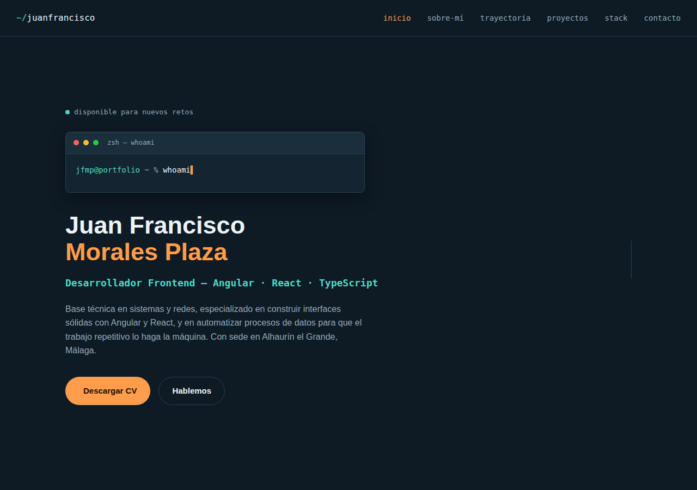

# Portfolio — Juan Francisco Morales Plaza

**Desarrollador Full Stack Junior (Angular · Java/Spring Boot · TypeScript · IA)** con base técnica en sistemas y redes, y experiencia en frontend y automatización de datos.

🔗 **Web en vivo:** https://juanfranciscomp30.github.io/portfolio-juanfrancisco/



## Sobre este proyecto

Portfolio personal construido a mano (sin frameworks ni plantillas), con una estética de terminal como hilo conductor. Sirve como CV interactivo: resume mi trayectoria, mis proyectos personales y mi stack técnico, con formulario de contacto directo.

## Secciones

- **Inicio** — presentación con efecto de terminal escribiendo en directo.
- **Proyectos destacados** — Gimnasio App con asistente de IA (Next.js + Prisma + Supabase + API de Claude) y FixFlow, gestor de reparaciones con Angular + Spring Boot, tests (JUnit 5, Mockito, Vitest) y CI con GitHub Actions. Ambos con demo en vivo.
- **Sobre mí** — quién soy, qué he hecho y qué busco.
- **Trayectoria** — experiencia y educación organizadas en capas desplegables, de la base (sistemas y redes) a lo más reciente (datos y automatización).
- **Otros proyectos** — travelXperience (Vue 3 + Pinia) y un e-commerce completo (Laravel) hecho como Trabajo de Fin de Grado.
- **Stack técnico** — frontend, backend, cloud/datos y herramientas que uso.
- **Contacto** — formulario (Web3Forms) y enlaces directos a email, teléfono, LinkedIn y GitHub.

## Stack técnico de esta web

HTML5 · CSS3 (sin frameworks) · JavaScript vanilla · [Boxicons](https://boxicons.com/) · Google Fonts (Space Grotesk, Inter, JetBrains Mono)

## Ejecutar en local

No necesita build ni dependencias, es HTML/CSS/JS estático:

```bash
git clone https://github.com/Juanfranciscomp30/portfolio-juanfrancisco.git
cd portfolio-juanfrancisco
# abre index.html en el navegador, o sirve la carpeta:
python3 -m http.server 8000
```

## Contacto

- Email: juanfranciscomoralesplaza30@gmail.com
- LinkedIn: [juan-francisco-morales-plaza](https://www.linkedin.com/in/juan-francisco-morales-plaza-383115254/)
- GitHub: [@Juanfranciscomp30](https://github.com/Juanfranciscomp30)
